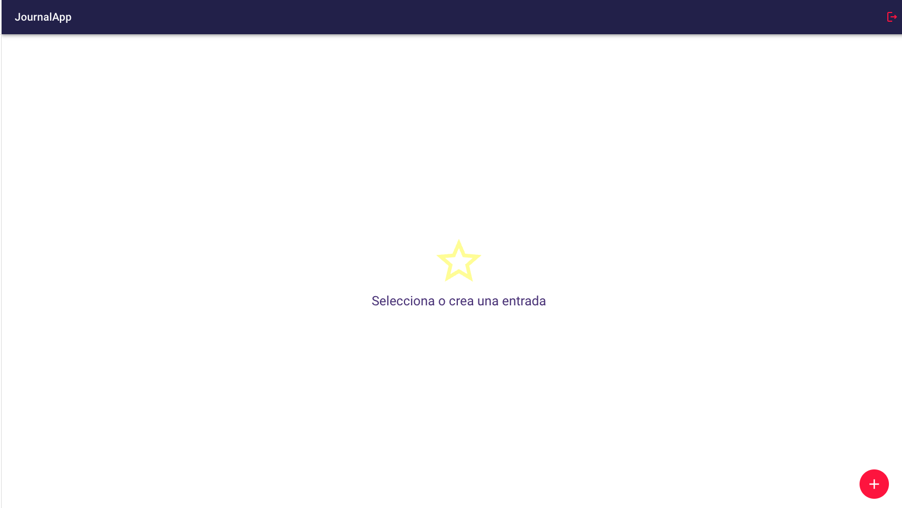

# Journal APP  
### Instalación
Clonar repositorio y agregar las dependencias:   
~~~
yarn
~~~

### Backend
Se utiliza Firebase/FireStone y Cloudinary.  

### Librerias
#### Estilos   

[Material UI](https://mui.com/)
~~~
"@mui/icons-material": "^5.8.4",
"@mui/material": "^5.8.4",
~~~

[sweetalert2](https://sweetalert2.github.io/)

~~~
"sweetalert2": "^11.4.18"
~~~

#### Backend
[Firebase](https://firebase.google.com/?gclid=CjwKCAjwquWVBhBrEiwAt1KmwkX-lAu65BnUqiy2zAxsZMQQEE18EdZkTSC1fJH7J4yqiw0pJfKvxxoCFZwQAvD_BwE&gclsrc=aw.ds)

~~~
"firebase": "^9.8.3",
~~~

Cloudinary   
[sweetalert2](https://cloudinary.com/)

### Gestión de estados
La gestión de los estados es mediante Redux con redujs-Toolkit.

### Navegación
React router dom versión 6

### Aplicación
La aplicación es una agenda de notas en las cuales se puede subir imágenes.

#### Login

#### Register

#### Journal Page

#### Note
